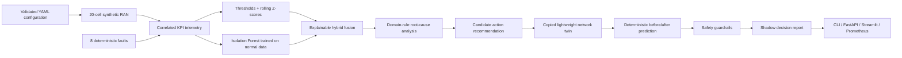

# AI-Assisted RAN Digital Twin for Closed-Loop Network Assurance

[](https://github.com/omidrahimirad/ai-ran-digital-twin-assurance/actions/workflows/ci.yml)
[](pyproject.toml)
[](LICENSE)

A vendor-neutral, simulation-based engineering prototype that turns deterministic
synthetic multi-cell RAN telemetry into explainable, safety-checked shadow decisions.
It is a portfolio implementation for exploring AI-assisted assurance, lightweight
Network Digital Twins, future-RAN verification, and closed-loop operational design.

> **Reported results are based on deterministic synthetic RAN scenarios and do not
> represent performance on a commercial mobile network.**

## Claim boundaries

This is a **6G-aligned, IMT-2030-inspired prototype**, not a claim of 6G or O-RAN
compliance. It is not production-ready, standards-conformant, commercially validated,
connected to an operator network, or able to execute an action on a real RAN. The
lightweight twin uses transparent engineering response factors—not RF propagation.
Every candidate action remains in shadow mode.

## Architecture



The dependency direction is domain → simulation/detection/diagnosis/twin →
workflow/evaluation/interfaces. See [architecture details](docs/architecture.md).

## Closed-loop workflow

1. Generate time-dependent synthetic telemetry for 20 cells.
2. Inject one configured fault with a known ground-truth interval and cause.
3. Detect hard threshold breaches and rolling multivariate deviations; use the
   normal-only Isolation Forest to confirm lower-specificity statistical findings.
4. Explain the probable root cause, evidence, and next diagnostic check.
5. Recommend a vendor-neutral candidate action.
6. Apply the action only to a copied twin state and predict KPI changes.
7. Reject or escalate unsafe, stale, repeated, excessive, or low-confidence proposals.
8. Produce a shadow-mode report. No network command interface exists.

## Supported synthetic faults

| Scenario | Main KPI signature | Ground-truth cause |
|---|---|---|
| Cell congestion | PRB saturation, latency rise, throughput/RRC pressure | Congestion |
| Increased interference | SINR loss, BLER rise, throughput loss | Interference |
| Missing neighbor relation | Handover failure and call-drop rise | Neighbor relation |
| Cell outage | Availability, access, mobility, and throughput collapse | Cell outage |
| Transport latency degradation | Latency rise without radio saturation | Transport |
| Coverage degradation | RSRP/SINR loss and drop rise | Coverage |
| Abnormal BLER increase | BLER rise and throughput loss | Radio quality |
| Mobility misconfiguration | Severe handover loss, drops, and delay | Mobility configuration |

Scenario timing, severity, targets, affected KPIs, and labels live in
[`config/scenarios.yaml`](config/scenarios.yaml).

## Installation

Requirements: Python 3.11 or 3.12. [`uv`](https://docs.astral.sh/uv/) is recommended.

```bash
git clone https://github.com/omidrahimirad/ai-ran-digital-twin-assurance.git
cd ai-ran-digital-twin-assurance
uv sync --extra dev
```

Standard virtual environments also work:

```bash
python -m venv .venv
source .venv/bin/activate
pip install -e '.[dev]'
```

## Local execution

```bash
# Small deterministic sample
uv run python -m ai_ran_assurance.cli generate-data --steps 6

# Complete telemetry → shadow-decision demo
uv run python -m ai_ran_assurance.cli demo --scenario congestion

# API and dashboard (separate terminals)
uv run python -m ai_ran_assurance.cli serve-api
uv run streamlit run dashboard/app.py
```

Valid demo names are `congestion`, `interference`, `missing_neighbor`, `outage`,
`transport_latency`, `coverage`, `bler`, and `mobility`.

## Docker execution

```bash
docker build -t ai-ran-assurance .
docker compose up --build
```

- API and Swagger UI: <http://localhost:8000/docs>
- Dashboard: <http://localhost:8501>
- Prometheus metrics: <http://localhost:8000/metrics>

The Compose services contain only the simulation/API/dashboard. They have no southbound
RAN connector and require no secrets.

## API examples

```bash
curl http://localhost:8000/health
curl http://localhost:8000/cells
curl -X POST http://localhost:8000/scenarios/run \
  -H 'Content-Type: application/json' \
  -d '{"scenario":"mobility"}'
curl http://localhost:8000/diagnoses
curl http://localhost:8000/recommendations
curl http://localhost:8000/decisions
```

The API also exposes `GET /network`, `/telemetry`, `/anomalies`, `/metrics`, and
`POST /actions/validate`. The OpenAPI document contains the Pydantic request/response
schemas for action validation.

## Dashboard

The Streamlit dashboard provides the network overview, scenario runner, Plotly KPI
traces, anomaly evidence, root-cause explanations, proposed actions, twin before/after
values, guardrail results, and the committed benchmark artifact. Start it locally with
the command above or as the `dashboard` Compose service.

## Reproducible benchmark

```bash
uv run pytest --cov=ai_ran_assurance \
  --cov-report=term-missing --cov-report=json:artifacts/coverage.json
uv run python scripts/run_benchmark.py
```

The second command rewrites [`artifacts/sample_results.json`](artifacts/sample_results.json)
and [`docs/results.md`](docs/results.md). The committed run used seed 42:

| Metric | Actual deterministic run |
|---|---:|
| Samples / scenarios | 11,520 / 8 |
| Precision / recall / F1 | 1.0000 / 1.0000 / 1.0000 |
| False-alarm rate | 0.0000 |
| Average detection delay | 0.000 minutes |
| Root-cause classification accuracy | 100.00% |
| Unsafe synthetic actions rejected | 100.00% (8 cases) |
| API health latency | 0.999 ms mean / 1.351 ms p95 (local run) |
| Core-package coverage | 98.32% |

These perfect classification values are bounded to the eight deterministic, deliberately
separable synthetic fault signatures. They must not be extrapolated to field telemetry,
unseen faults, vendor implementations, or commercial-network performance.

## Tests and CI

```bash
uv run ruff check .
uv run ruff format --check .
uv run mypy src
uv run pytest
uv run pytest --cov=ai_ran_assurance --cov-report=term-missing
```

The 51-test suite covers configuration errors, all fault injectors, reproduction,
normal-only model fitting, explainable diagnosis, every twin action, stale telemetry,
all unsafe-action classes, API contracts, CLI behavior, every scenario workflow, and an
end-to-end fault-to-shadow-report path. GitHub Actions runs Ruff, MyPy, tests/coverage on
Python 3.11 and 3.12, plus a Docker build without repository secrets.

## Repository structure

```text
config/                       validated network, threshold, scenario YAML
src/ai_ran_assurance/
  domain/                     typed models and enums
  simulation/                 topology, correlated KPIs, eight faults
  detection/                  rules/rolling statistics and Isolation Forest
  diagnosis/                  explainable root-cause rules
  twin/                       copied state, actions, prediction, guardrails
  evaluation/                 metrics and deterministic benchmark
  api/                        FastAPI schemas and endpoints
  workflow.py                 complete closed-loop orchestration
  cli.py                      Typer commands
dashboard/app.py              Streamlit/Plotly interface
tests/{unit,integration,e2e}/ automated verification
data/samples/                 small reproducible synthetic sample
artifacts/                    machine-readable benchmark result
docs/                         design, method, assumptions, results, limits
```

## Limitations

- Synthetic KPI relationships and fault effects are intentionally simplified.
- No RF propagation, protocol stack, UE-level mobility, alarm stream, topology discovery,
  online learning, uncertainty calibration, persistence, or real-time ingestion exists.
- The Isolation Forest sees only the generated baseline distribution.
- API latency is a local in-process health check, not a load or scalability benchmark.
- Guardrail approval means “safe enough to report in shadow mode,” never authorization to
  change a network.

See the full [limitations](docs/limitations.md) and [assumptions](docs/assumptions.md).

## Roadmap

- Add distribution-shift, ambiguous multi-fault, noisy-label, and missing-data scenarios.
- Calibrate prediction uncertainty and benchmark multiple time-aware validation splits.
- Add energy-aware objectives, richer mobility/topology models, and persisted experiment
  lineage.
- Define adapter interfaces for offline standards-derived traces without claiming a real
  RIC or operator integration.
- Add signed policy bundles and human approval audit records before considering any
  integration research.

## CV-ready project summary

Designed and implemented a Python 3.11+ vendor-neutral AI-assisted RAN assurance
prototype for 20-cell deterministic synthetic networks. Built correlated KPI generation,
eight reproducible fault scenarios, threshold/rolling-statistics plus Isolation Forest
detection, explainable root-cause analysis, copy-based network-twin action prediction,
and safety guardrails that emit shadow-only decisions. Delivered FastAPI, Streamlit,
Typer, Prometheus, Docker/Compose, strict typing/linting, 51 automated tests with 98.32%
core coverage, reproducible benchmark artifacts, and multi-version CI—while maintaining
explicit boundaries against 6G/O-RAN compliance and real-network claims.

## Further reading

- [Architecture](docs/architecture.md)
- [Methodology](docs/methodology.md)
- [Assumptions](docs/assumptions.md)
- [Results](docs/results.md)
- [Limitations](docs/limitations.md)
- [6G alignment](docs/six_g_alignment.md)

Licensed under the [MIT License](LICENSE).
