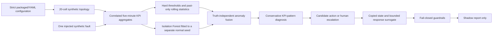

# Synthetic RAN Assurance with a State-and-Response Surrogate

[](https://github.com/omidrahimirad/ai-ran-digital-twin-assurance/actions/workflows/ci.yml)
[](pyproject.toml)
[](LICENSE)

A portfolio-scale Python implementation of a synthetic, multi-cell RAN assurance
pipeline. It combines explicit KPI rules with an Isolation Forest, produces
evidence-based diagnoses, evaluates conservative what-if actions on copied state, and
ends at a safety-checked shadow report.

> **All telemetry and results are synthetic. Nothing here demonstrates performance on a
> commercial network.**

## Technical boundaries

This repository is not an RF simulator, a network digital twin in a standards or
high-fidelity sense, an O-RAN RIC/xApp/rApp, or a deployable closed-loop controller. The
class named `NetworkTwin` is a copied topology/configuration/KPI state container. Its
`TwinSimulator` is a bounded deterministic response surrogate, not a learned, calibrated,
or causal predictor.

The “AI” component is one unsupervised Isolation Forest. Rules remain responsible for
hard thresholds and root-cause mapping. There is no deep learning, online learning,
foundation model, 6G implementation, O-RAN interface, operator data, or southbound
actuation. Only a congestion diagnosis produces an automated shadow candidate; every
other diagnosis is escalated for human review.

## Pipeline



Synthetic ground truth is attached to generated records for evaluation. The workflow
does not use scenario target cells, active windows, or labels to select anomalies or
diagnoses. Training seed `17` and evaluation seeds `101`, `211`, and `307` are separate
in the committed benchmark.

## Synthetic domain model

The generator represents twenty cells with four directed neighbor choices per cell. A
24-hour baseline includes morning/evening demand peaks, cell-specific bias, and seeded
autoregressive load, signal, and interference state. Offered demand, achievable radio
throughput, PRB use, queue-related latency, BLER, RRC success, handover success, call
drops, and availability are related by transparent equations.

These are dimensional engineering abstractions, not vendor counter definitions or
3GPP-compliant models. Scenario labels are intentionally more specific than the evidence
can always support:

| Synthetic scenario | Injected evidence | Workflow interpretation |
|---|---|---|
| Congestion | PRB/queue pressure, throughput and RRC loss | Congestion candidate |
| Interference | SINR loss, BLER and drop rise | Interference only when the compound signature is strong |
| Missing neighbor | Handover loss and drops | Ambiguous mobility evidence; human review |
| Cell outage/degradation | Availability, access, mobility, throughput collapse | Outage only for a sufficiently compound collapse |
| Transport latency | Delay rise without radio saturation | Transport candidate; human review |
| Coverage degradation | RSRP/SINR loss plus access/drop effects | Coverage only when the compound signature is strong |
| BLER increase | BLER, throughput and drop effects | Radio-quality candidate; human review |
| Mobility misconfiguration | Handover loss and drops | Ambiguous mobility evidence; human review |

## Install and reproduce

Python 3.11 or 3.12 and [`uv`](https://docs.astral.sh/uv/) are recommended.

```bash
git clone https://github.com/omidrahimirad/ai-ran-digital-twin-assurance.git
cd ai-ran-digital-twin-assurance
uv sync --frozen --extra dev
```

The package includes validated default YAML, so it also works outside the repository:

```bash
python -m venv .venv
source .venv/bin/activate
pip install -e '.[dev]'
ai-ran-assurance demo --scenario congestion
```

Set `AI_RAN_CONFIG_DIR` to a directory containing `network.yaml`, `thresholds.yaml`, and
`scenarios.yaml` to use an explicit configuration. Unknown fields, inconsistent fault
truth, unknown cells/KPIs, invalid bounds, naive timestamps, and non-finite numeric values
are rejected.

## Run the actual surfaces

```bash
# Deterministic CSV sample
uv run ai-ran-assurance generate-data --steps 6 --seed 42

# Synthetic telemetry-to-shadow-report replay
uv run ai-ran-assurance demo --scenario congestion

# Local-only API by default, plus dashboard in another terminal
uv run ai-ran-assurance serve-api
uv run streamlit run dashboard/app.py
```

Valid scenarios are `congestion`, `interference`, `missing_neighbor`, `outage`,
`transport_latency`, `coverage`, `bler`, and `mobility`.

The FastAPI surface exposes health, topology, telemetry, anomalies, diagnoses,
recommendations, shadow decisions, metrics, scenario replay, and action validation.
Action validation accepts only an action and a timestamp that exists in stored telemetry;
the server recomputes the response and uses server time for freshness. Client-supplied
predictions or evaluation times are rejected. There is no authentication or rate limiting,
so this demo API should not be exposed to an untrusted network.

## Docker

```bash
docker build -t ai-ran-assurance .
docker compose config --quiet
docker compose up --build
```

- API and OpenAPI: <http://localhost:8000/docs>
- dashboard: <http://localhost:8501>
- Prometheus exposition: <http://localhost:8000/metrics>

The multi-stage image installs the locked runtime environment, runs as UID 10001, and
contains no command adapter or secret. Compose explicitly opts into container-wide binds
and applies `no-new-privileges`; local CLI startup binds only to `127.0.0.1`.

## Reproduced evaluation

```bash
uv run pytest --cov=ai_ran_assurance \
  --cov-report=term-missing --cov-report=json:artifacts/coverage.json
uv run python scripts/run_benchmark.py
```

The benchmark runs 48 closed-set episodes: eight configured scenarios, three holdout
seeds, and severities `0.55` and `0.8`. Truth is used by the evaluator for scoring, not by
the workflow. The committed result is intentionally not perfect:

| Metric | Reproduced result |
|---|---:|
| Telemetry samples / episode runs | 220,800 / 48 |
| Precision / recall / F1 | 1.0000 / 0.5399 / 0.7012 |
| Fault-episode detection rate | 79.17% |
| RCA accuracy on diagnosed episodes | 52.63% |
| Ambiguous diagnosed episodes | 18 |
| Unsafe/escalation guardrail cases rejected | 16 / 16 |
| Safe guardrail control approved | 1 / 1 |
| API health smoke | 25 / 25 successful |
| Branch-aware package coverage | 94.43% |

Missed episodes are counted as false negatives. RCA accuracy excludes undetected
episodes and must therefore be read with the episode detection rate. The zero sample
false-alarm rate is only an observation on generated normal intervals from the same
closed-set family. No API latency is reported because an in-process client is not a load
or service benchmark. See [the generated results](docs/results.md).

## Quality and security gates

```bash
uv run ruff check .
uv run ruff format --check .
uv run mypy src
uv run pytest --cov=ai_ran_assurance --cov-report=term-missing
make security
```

The 70 tests cover deterministic generation, KPI relationships, contaminated-training
rejection, truth-independent workflow selection, ambiguous RCA, conservative action
effects, impacted-cell checks, stale/future telemetry, low confidence, cooldown, strict
API schemas, server-side prediction, CLI/API/E2E behavior, and benchmark generation. The
security target audits the exact locked runtime export and statically scans Python code.
CI repeats quality checks on Python 3.11/3.12, verifies generated artifacts on 3.11,
validates Compose, and builds the image.

## Remaining limitations

- No UE, bearer, packet, scheduler, alarm, PM counter, propagation, fading, beam,
  multi-carrier, energy, or protocol model exists.
- Faults are single and deterministic; missing data, concept drift, concurrent faults,
  topology changes, and external datasets are not evaluated.
- Thresholds, RCA weights, response factors, and confidence values are illustrative and
  uncalibrated.
- The in-memory API has no persistence, identity, authorization, multi-user isolation,
  high availability, or operator approval workflow.
- Guardrail approval means only that a candidate may appear in a shadow report.

Read [architecture](docs/architecture.md), [methodology](docs/methodology.md),
[assumptions](docs/assumptions.md), [limitations](docs/limitations.md), and
[future-RAN boundaries](docs/six_g_alignment.md) for the full audit trail.
