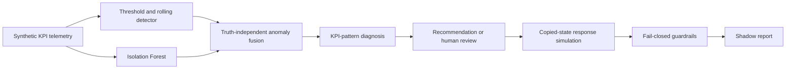

# AI-Assisted RAN Assurance with Shadow-Mode Action Validation

[](https://github.com/omidrahimirad/ai-ran-digital-twin-assurance/actions/workflows/ci.yml)
[](pyproject.toml)
[](LICENSE)

A vendor-neutral engineering prototype for multi-cell RAN monitoring, hybrid anomaly
detection, explainable root-cause analysis, and safety-checked evaluation of corrective
actions in shadow mode.

The project provides a reproducible reference pipeline from time-aligned KPI telemetry
to a non-executable shadow decision. Explicit rules handle policy and safety boundaries;
an Isolation Forest supplements statistical anomaly detection; deterministic what-if
responses make action evaluation inspectable and testable.

## Key capabilities

- Generates deterministic five-minute KPI aggregates for a configurable 20-cell
  synthetic topology and eight fault scenarios.
- Combines hard KPI thresholds, past-only rolling statistics, and an Isolation Forest
  trained on a separate normal-data seed.
- Produces evidence-based diagnoses with confidence, explanations, and a next diagnostic
  check; ambiguous mobility evidence remains explicitly unresolved.
- Maps diagnosed congestion to a conservative capacity candidate and escalates other
  diagnoses for human review.
- Evaluates proposed actions against copied topology, configuration, and KPI state using
  bounded deterministic response equations.
- Applies fail-closed checks for stale evidence, low confidence, impacted-cell risk,
  action size, chronology, cooldown, and KPI safety limits.
- Exposes the workflow through a CLI, FastAPI service, Streamlit dashboard, Prometheus
  metrics, and a reproducible closed-set evaluation.

## Example scenario

Run the default congestion replay:

```bash
uv run --frozen ai-ran-assurance demo --scenario congestion
```

The current deterministic demo follows this sequence:

1. **Detection:** high PRB utilization is identified in `CELL-003` during the injected
   congestion interval.
2. **Diagnosis:** the KPI pattern is classified as congestion with supporting evidence
   and a confidence score.
3. **Recommendation:** the policy proposes a 15% additional-capacity candidate for
   shadow evaluation.
4. **State simulation:** copied state is evaluated with bounded response equations,
   producing explicit before/after KPI values and assumptions.
5. **Guardrail decision:** the default replay is rejected because its evidence is stale
   at evaluation time and the response confidence is below the configured minimum.
6. **Shadow report:** the result is recorded as `shadow_rejected`; no network command is
   produced or sent.

This path is intentionally useful even when the outcome is rejection: it demonstrates
that a recommendation cannot bypass the final safety boundary.

## System workflow



Ground truth is retained for evaluation only. It is not used to select workflow
anomalies, infer diagnoses, or approve actions.

<!-- TODO: Add docs/assets/workflow-demo.gif when a stable capture is available. -->

## Architecture

| Layer | Responsibility |
| --- | --- |
| [Configuration](src/ai_ran_assurance/config.py) | Validates packaged or external network, threshold, and scenario YAML. |
| [Simulation](src/ai_ran_assurance/simulation/) | Builds topology, generates correlated KPIs, and applies synthetic faults. |
| [Detection](src/ai_ran_assurance/detection/) | Runs rule, rolling-statistic, and Isolation Forest detection. |
| [Diagnosis](src/ai_ran_assurance/diagnosis/) | Maps compound KPI evidence to conservative root-cause categories. |
| [State and response](src/ai_ran_assurance/twin/) | Copies network state, evaluates bounded responses, and enforces guardrails. |
| [Workflow](src/ai_ran_assurance/workflow.py) | Orchestrates telemetry, detection, diagnosis, recommendation, and reporting. |
| [Interfaces](src/ai_ran_assurance/api/) | Provides API contracts, runtime state, health, and Prometheus endpoints. |
| [Evaluation](src/ai_ran_assurance/evaluation/) | Scores deterministic scenario episodes without exposing truth to the workflow. |

The dependency direction is domain → simulation/detection/diagnosis/state response →
workflow/evaluation/interfaces. See the [architecture and safety boundary](docs/architecture.md)
for component-level data-flow and trust-boundary details.

## Quick start

Python 3.11 or 3.12 and [`uv`](https://docs.astral.sh/uv/) are recommended.

```bash
git clone https://github.com/omidrahimirad/ai-ran-digital-twin-assurance.git
cd ai-ran-digital-twin-assurance
uv sync --frozen --extra dev
uv run --frozen ai-ran-assurance demo --scenario congestion
```

Generate a small deterministic CSV sample:

```bash
uv run --frozen ai-ran-assurance generate-data --steps 6 --seed 42
```

Available scenarios are `congestion`, `interference`, `missing_neighbor`, `outage`,
`transport_latency`, `coverage`, `bler`, and `mobility`.

The default validated YAML is packaged with the application. To supply an alternative
configuration, set `AI_RAN_CONFIG_DIR` to a directory containing `network.yaml`,
`thresholds.yaml`, and `scenarios.yaml`.

For containers:

```bash
docker compose config --quiet
docker compose up --build
```

## Dashboard and API

Start the interfaces in separate terminals:

```bash
uv run --frozen ai-ran-assurance serve-api
uv run --frozen streamlit run dashboard/app.py \
  --server.address=127.0.0.1 \
  --browser.gatherUsageStats=false
```

- OpenAPI: <http://localhost:8000/docs>
- Health: <http://localhost:8000/health>
- Prometheus metrics: <http://localhost:8000/metrics>
- Dashboard: <http://localhost:8501>

The API exposes topology, telemetry, anomalies, diagnoses, recommendations, shadow
decisions, metrics, scenario replay, and server-side action validation. Local CLI startup
binds to `127.0.0.1` by default.

<!-- TODO: Add docs/assets/dashboard-overview.png after the dashboard capture is finalized. -->

## Reproduced evaluation summary

The committed evaluation covers 48 closed-set synthetic episodes across eight scenarios,
three evaluation seeds, and two severities. These are reproduced software-test results,
not field-network performance measurements.

| Metric | Reproduced result |
| --- | ---: |
| Fault-episode detection | 79.17% |
| Precision | 1.0000 |
| Recall | 0.5399 |
| F1 | 0.7012 |
| RCA accuracy on diagnosed episodes | 52.63% |
| Tests | 70 passing |
| Branch coverage | 94.29% in Linux CI |

Run the same checks with:

```bash
uv run --frozen pytest --cov=ai_ran_assurance --cov-report=term-missing
uv run --frozen python scripts/run_benchmark.py
```

See [reproduced evaluation results](docs/results.md) for the complete protocol,
scenario-level outcomes, metric interpretation, and guardrail regression results.

## Scope and limitations

- All telemetry, faults, and evaluation results are synthetic; there is no live-network
  ingestion or operator dataset.
- The project does not implement an O-RAN RIC, xApp/rApp, O1/A1/E2 integration, or
  standards compliance validation.
- No network actuation path exists. An approved decision is only eligible for inclusion
  in a shadow report.
- `NetworkTwin` holds copied topology, configuration, and KPI state. Its simulator is a
  deterministic response model, not an RF simulator, calibrated causal model, or
  standards-grade digital twin.
- Thresholds, root-cause weights, action effects, and confidence values are illustrative
  and uncalibrated.
- The in-memory interfaces do not provide authentication, persistence, high availability,
  or multi-user isolation and should not be exposed to an untrusted network.

The [limitations](docs/limitations.md) page provides the full modeling, ML, safety, and
operational boundaries.

## Detailed documentation

- [Architecture and safety boundary](docs/architecture.md) — components, dependency
  direction, state-surrogate boundary, and runtime trust model.
- [Methodology](docs/methodology.md) — synthetic KPI equations, fault injection,
  detection, diagnosis, response rules, guardrails, and evaluation protocol.
- [Assumptions](docs/assumptions.md) — explicit network, telemetry, training, safety,
  and reproducibility assumptions.
- [Reproduced evaluation results](docs/results.md) — complete benchmark results and
  scenario-level outcomes.
- [Limitations](docs/limitations.md) — telecom, modeling, ML, safety, and operational
  constraints.
- [Future-RAN relevance and standards boundaries](docs/six_g_alignment.md) — precise
  relationship to future-network research topics without compliance claims.

## License

Released under the [MIT License](LICENSE).
