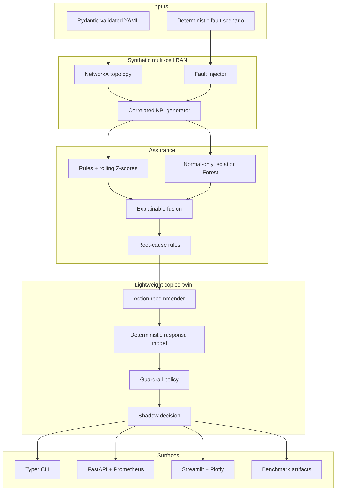

# Architecture

## Scope

This repository implements a simulation-based, vendor-neutral assurance prototype using
synthetic data. The architecture is intentionally modular so simulation, analytics,
policy, and delivery surfaces can be verified separately. It is not an RF-accurate
network simulator, an O-RAN RIC, or a real-network automation platform.

## Components

## Dependency and state rules

- `domain` owns Pydantic data contracts and enums and imports no higher layer.
- `simulation` owns deterministic topology, traffic/KPI relationships, and fault effects.
- `detection` implementations share a protocol. Isolation Forest fitting filters for
  `normal` ground truth and uses a fixed seed.
- `diagnosis` uses vendor-neutral KPI combinations; it does not consume ground truth.
- `twin` copies topology, neighbor state, configurations, traffic, and latest KPI state
  before applying transparent response factors.
- `workflow` orchestrates a run and retains no external-network integration.
- `api`, `cli`, `dashboard`, and `evaluation` consume the workflow rather than duplicate it.

## Hybrid decision rule

A configured hard safety threshold can emit an interpretable anomaly directly. A
lower-specificity rolling Z-score finding is emitted by the workflow only if the
independently trained Isolation Forest agrees on the same cell and timestamp. This makes
fusion inspectable and prevents the unsupervised score from overriding safety rules.

## Shadow-mode safety boundary

The last executable boundary is a `ShadowDecision` model. The code has no NETCONF,
RESTCONF, gNMI, RIC, EMS, OSS, vendor CLI, or other southbound actuation client. Guardrail
approval means only that a candidate may appear in a report.

## Runtime surfaces

- CLI for deterministic data generation, scenario demos, benchmarking, and API startup.
- FastAPI for topology, telemetry, findings, decisions, validation, and metrics.
- Streamlit for interactive inspection of the same in-process workflow.
- Docker Compose for independently starting the API and dashboard containers.
