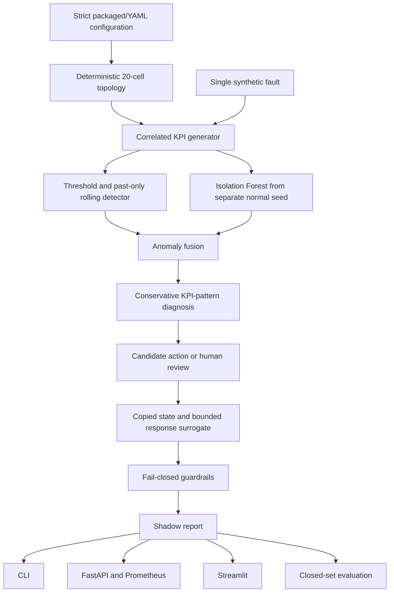

# Architecture and safety boundary

## Scope

The repository implements an offline synthetic assurance pipeline. It is modular enough
to test configuration, simulation, analytics, policy, and interfaces independently. It
is not an RF simulator, standards-grade network digital twin, O-RAN RIC, or real-network
automation platform.

## Dependency and data-flow rules

- `domain` owns strict Pydantic contracts and imports no higher layer.
- `simulation` owns the topology, KPI equations, time state, and fault injection.
- `detection` uses past-only rolling windows. Isolation Forest fitting rejects any
  sample not explicitly marked normal; it never silently filters a mixed training set.
- `diagnosis` receives only an anomaly and the matching KPI sample. It does not receive
  scenario metadata or ground truth.
- `twin` copies one timestamp of known-cell telemetry plus topology/configuration.
  `NetworkTwin` is a state container; `TwinSimulator` is a response surrogate.
- `workflow` does not filter findings by configured target cell or active fault window.
  It retains the most recent anomaly per cell and evaluates freshness against the latest
  timestamp in the replay.
- `evaluation` alone uses target cells, active windows, and labels for scoring.
- API action validation accepts stored telemetry references and recomputes the surrogate
  result server-side. It does not trust a client prediction or client clock.

## Detection fusion

Configured hard-threshold findings enter directly. A lower-specificity rolling finding
enters only when the independently fitted Isolation Forest also flags the identical cell
and timestamp. The Isolation Forest does not override a hard safety threshold. This is a
fixed, inspectable heuristic—not a trained ensemble or calibrated probability model.

## State-surrogate boundary

The copied state contains topology, enabled relations, cell configuration, and exactly
one KPI aggregate per included cell at one timestamp. Actions are rejected if required
state is absent or inconsistent. Neighbor restoration can only enable a specific disabled
relation already present in copied topology. Traffic steering checks the enabled target,
availability, headroom, and both source and target KPI effects.

Response factors are bounded, deterministic, and accompanied by assumptions and low
confidence. They do not estimate causality, propagation, scheduler behavior, or RF
performance.

## Shadow safety boundary

The last boundary is `ShadowDecision`. Guardrails check action/prediction identity,
primary and impacted-cell KPI limits, absolute and relative availability, action size,
cooldown, timestamps, stale/future evidence, diagnosis confidence, and surrogate
confidence. Any human-review candidate is an explicit escalation.

There is no NETCONF, RESTCONF, gNMI, O1, A1, E2, RIC, EMS/OSS, vendor CLI, or command
executor. “Approved” means approved to appear in a shadow report only.

## Runtime state

The API and dashboard retain the latest run in process. The API uses a lock around run
replacement, but there is no database, queue, authentication, authorization, experiment
lineage store, or multi-user isolation. Prometheus labels use route templates rather than
raw untrusted paths to bound cardinality.
